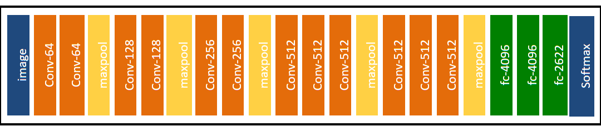
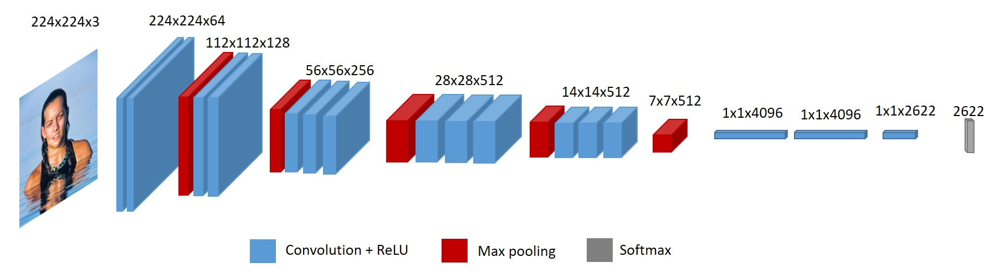

# Face Matching

This project compares two faces and detects if they are the same person. It is based on the `One-Shot Learning for Face Recognition` technique.

This technique is useful to implement a face recognition mechanism for a small dataset. For instance, imagine that you want to check if a person entering in a local is known or not. You just need to store the faces of the authorized persons in a dataset and then compared their faces to the person entering.

This project is based on the `VGGFace` neural network developed by the [Visual Geometry Group (VGG)](http://www.robots.ox.ac.uk/~vgg/) at the University of Oxford.

The original VGGFace is implemented in Caffe and PyTorch.

This project implements a `Keras/Tensorflow 2` version of the `VGGFace` Neural Network.


## VGGFace

The VGGFace model, named later, was described by Omkar Parkhi in the 2015 paper titled “[Deep Face Recognition](http://www.robots.ox.ac.uk/~vgg/publications/2015/Parkhi15/parkhi15.pdf).”

VGGFace ([poster](http://www.robots.ox.ac.uk/~vgg/publications/2015/Parkhi15/poster.pdf), [Dataset](https://www.robots.ox.ac.uk/~vgg/data/vgg_face/)), proposed by the Visual Geometry Group of the University of Oxford , is a variation of VGG16.





VGGFace is implemented in Caffe and PyTorch.


## One-Shot Learning for Face Recognition

The principle of the `One-Shot Learning for Face Recognition` technique is pretty simple. A face goes through the VGGFace Neural Network that produces a vector with 2622 dimensions.

Then, we compare the vector of the target face against the vector of the reference face by measuring the ` euclidean distance` between the two vectors. If this distance is lower to a defined threshold, the two faces match!

### Literature

  * [Face Recognition - A One-Shot Learning Perspective](https://conferences.computer.org/sitis/2019/pdfs/SITIS2019-3lg6NqN9oVMEKqMkwx1H8g/1qXzXxGdhOZkyBTeTUxtDY/3VMrgizkqxZPMnXwAoc3VQ.pdf),
  * [FaceNet: A Unified Embedding for Face Recognition and Clustering](https://arxiv.org/pdf/1503.03832.pdf),
  * [Siamese Neural Networks for One-shot Image Recognition](https://www.cs.cmu.edu/~rsalakhu/papers/oneshot1.pdf),
  * [One-Shot Learning for Face Recognition](https://machinelearningmastery.com/one-shot-learning-with-siamese-networks-contrastive-and-triplet-loss-for-face-recognition/),
  * [Face Recognition with One-Shot Learning
](https://blog.netcetera.com/face-recognition-using-one-shot-learning-a7cf2b91e96c),
  * [One-Shot Learning: Face Recognition using Siamese Neural Network](https://towardsdatascience.com/one-shot-learning-face-recognition-using-siamese-neural-network-a13dcf739e),
  * [One shot learning explained using FaceNet](https://medium.com/intro-to-artificial-intelligence/one-shot-learning-explained-using-facenet-dff5ad52bd38),


## Quick Startup

### Download SDD weights

Download the SSD weights from [here](https://drive.google.com/file/d/124BPpIJbJZycXAU05Har0sur46o7HpVU/view?usp=sharing) and copy them in the `weights` folder.


### Create a Virtual Environment

If you are on MacOS or Linux, type the following command to create a python virtual environment and install the required packages:

```bash
./configure.sh
```

Then, activate the virtual environment:

```bash
source .venv/bin/activate
```

***Nota***:
<br>This project requires `python 3`. You must install it first.


### Run

Under the virtual environment, execute the command:

```bash
python src/main.py --source './datasets/faces/angelina2.jpg' --target './datasets/faces/angelina.jpg'
```

You should get:

```bash
euclidean distance: 117.61527, cosine similarity: 0.2544904947280884, match: Yes!
```

Then try:

```bash
python src/main.py --source './datasets/faces/monica.jpg' --target './datasets/faces/angelina.jpg'
```

You should get:

```bash
euclidean distance: 143.571, cosine similarity: 0.4739534854888916, match: No!
```

And finally try:

```bash
python src/main.py --source './datasets/faces/joey.jpg' --target './datasets/faces/angelina.jpg'
```

You should get:

```bash
euclidean distance: 172.55217, cosine similarity: 0.7466022074222565, match: No!
```


## License

MIT.
